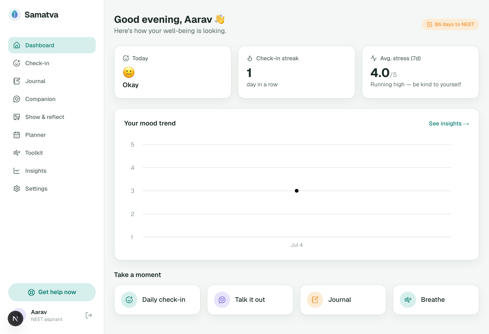
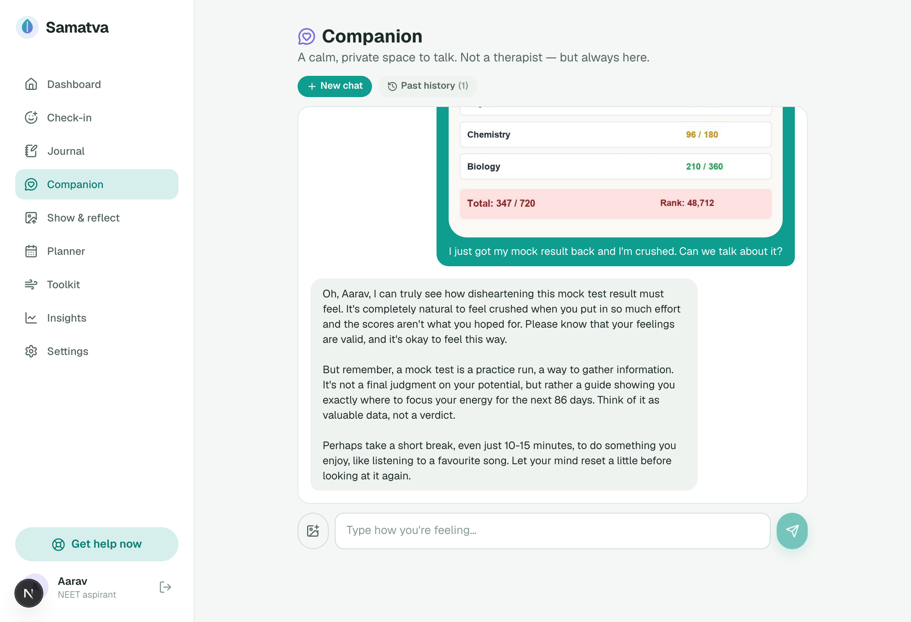
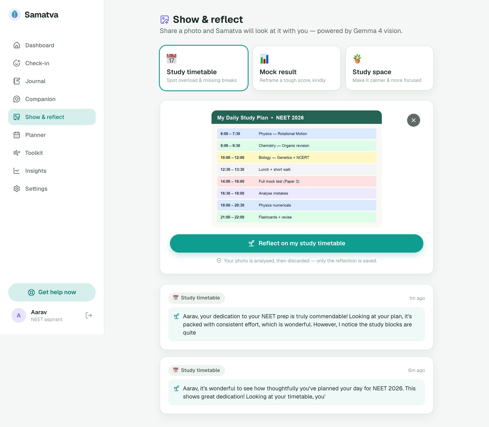
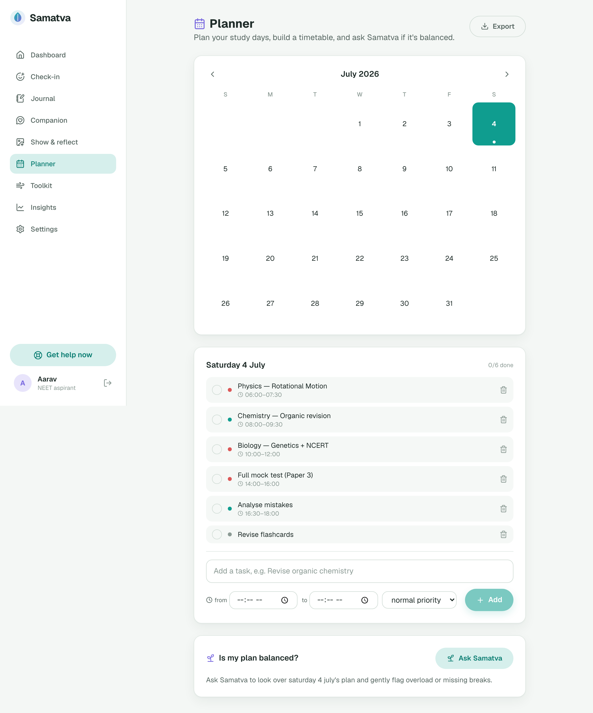

<div align="center">

# 🌱 Samatva

**समत्व** — *equanimity, balance of mind.*

An AI mental well-being companion for Indian high-stakes exam aspirants — **JEE · NEET · UPSC · GATE · CAT**.
Powered end-to-end by **Gemma 4** (language *and* vision), grounded with RAG, and safe by design.

[**🚀 Live app**](https://samatva-ai-blue.vercel.app) · [Features](#-features) · [How it works](#-how-the-ai-works) · [Getting started](#-getting-started)


</div>

---

## 💡 The problem

Every year millions of Indian students sit for JEE, NEET, UPSC, GATE and CAT. The pressure is relentless — anxiety, burnout, sleep loss, crushing comparison culture, and, at coaching hubs like Kota, a genuine mental-health crisis. Yet real support is scarce: therapy is expensive, stigmatized, and never available at 2 AM before a mock test — which is exactly when a stressed aspirant needs it most.

**Samatva** is a private, always-on, judgment-free companion built *specifically* for that student. Not a therapist, not a productivity app — a calm space to talk, reflect, plan, and be reminded that one bad mock doesn't define you. And it's built to be **safe by design**: crisis language is caught deterministically and connected to real India helplines *before* the model ever runs.

---

## ✨ Features

### 💬 AI Companion (the core)
- **Live Gemma 4 chat** — warm, contextual, exam-aware conversation.
- **Session-based** — every chat is its own thread with a persistent ID; start a new chat anytime.
- **Dedicated, searchable history** — built to scale past 100+ conversations.
- **RAG-grounded** — replies draw on a curated well-being knowledge base, so advice is real technique, not generic reassurance.
- **📷 Photo attachment (multimodal)** — attach a photo *and* talk about it in the same message; Gemma 4 vision reads image + text together. The image is processed then **discarded, never stored**.
- **Tab-switch resilient** — generation continues server-side and re-syncs when you return.

### 🖼️ Vision
- Upload a **timetable**, **mock result**, or **study space** and get a grounded Gemma 4 vision reflection.
- Client-side resize before upload; images analyzed then discarded.

### 🙂 Daily Check-in & Tracking
- 10-second pulse on **mood, energy, stress, sleep**, plus an optional note. One check-in per day, editable. Sleep hard-capped at 24h.

### 📓 Journal + AI Reflection
- Write freely; receive a short, warm, RAG-grounded reflection back.

### 🗓️ Planner / Task Calendar
- Build a daily timetable of timed study blocks and untimed to-dos (title, date, start/end, priority).
- **Ask Samatva's opinion** on your plan — an honest take on whether it's balanced.
- **Export to Excel** (SheetJS). Fully ownership-isolated per user.

### 📊 Insights
- **AI weekly summary** plus mood trends, mood distribution, sleep/stress averages, and a check-in streak.

### 🧘 Calm Toolkit
- **Breathe** (guided breathing), **Grounding** (5-4-3-2-1), and a **Focus** timer.

### 🛟 Safety layer (non-negotiable)
- A **deterministic** crisis screen runs *before* the model on every message — even when a photo is attached — and surfaces India helplines (**Tele-MANAS, KIRAN, iCall, Vandrevala, AASRA**) with a caring response. Never a model guess.

### 🔒 Privacy
- Photos are never persisted. Delete all your data anytime from Settings. Per-user isolation everywhere.

---

## 🧠 How the AI works

Samatva has **no training or fine-tuning** — the intelligence is entirely **prompt engineering + RAG + safety orchestration** on top of Gemma 4.

| Technique | What we do |
|-----------|-----------|
| **Model** | **Gemma 4** (`gemma-4-26b-a4b-it`) for language and vision, via an OpenAI-compatible endpoint. |
| **Resilience** | A **multi-model fallback chain** (`gemma-4-31b-it` → `gemini-2.5-flash` as last-resort insurance) so a free-tier outage never breaks the app; warm hand-written fallbacks if all else fails. |
| **RAG** | A curated **~30-snippet** well-being KB retrieved with a **lexical BM25-lite** ranker (TF×IDF + tag boosting) — deterministic, dependency-free, and it kept working even when the embeddings endpoint was unavailable. |
| **Prompt engineering** | A hand-tuned *Samatva* persona, per-user context injection (name, exam, days-to-exam), and **reasoning-token stripping** so Gemma's private `<thought>` blocks never reach the student. |
| **Multimodality** | OpenAI-format image content parts — the same `chat()` path handles text and `text + image_url`. |
| **Safety** | Deterministic, idiom-safe crisis screening in `src/lib/safety.ts`, independent of the model. |

> The provider is pluggable: **hosted Gemma** in production, **Ollama** locally (no key, no cloud).

---

## 🧱 Tech stack

| Layer | Choice |
|-------|--------|
| Framework | Next.js 16 (App Router, Turbopack) + React 19 |
| Language | TypeScript |
| Styling | Tailwind CSS v4 |
| AI | Gemma 4 (hosted OpenAI-compatible API) / Ollama for local dev |
| Auth | bcrypt password hashing + signed-cookie JWT sessions (`jose`) |
| Storage | JSON files locally · **Vercel KV / Upstash Redis** in production |
| Excel | SheetJS (`xlsx`) |
| Icons | lucide-react |
| Hosting | Vercel |
| Tests | Node test runner via `tsx` |

---

## 📸 Screenshots

> _Drop PNGs into `docs/screenshots/` with these names and they'll render here._

| Dashboard | Companion + photo |
|---|---|
|  |  |

| Vision | Planner & Insights |
|---|---|
|  |  |

---

## 🚀 Getting started

### Prerequisites
- **Node.js 20+**
- (Optional) **Ollama** for fully-local Gemma, or a free **Google AI Studio** key for hosted Gemma.

### 1. Install
```bash
